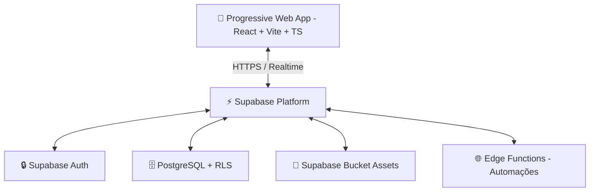

# 🚀 Documentação Técnica e Funcional: Esportiz

Esta é a documentação oficial, técnica e funcional do **Esportiz**, um ecossistema completo (ERP/SaaS) para gestão inteligente de escolas de esportes de alto rendimento e arenas esportivas multiuso (Beach Tennis, Futevôlei, Vôlei de Praia, Estúdios e Cursos).

---

## 🧭 1. Visão Geral e Propósito

O **Esportiz** foi concebido sob a premissa de que a gestão esportiva e de quadras deve ser altamente dinâmica, acessível e focada na experiência mobile (mobile-first). O aplicativo unifica o controle operacional, o CRM de alunos/reservantes, o fluxo financeiro de mensalidades e locações, o PDV (Ponto de Venda) com controle rigoroso de estoque, e ferramentas inteligentes de atração (Portal do Aluno, Matrícula Online e Locação de Quadras Online) em uma interface Progressive Web App (PWA) de alto padrão estético.

---

## 🛠️ 2. Arquitetura e Stack Tecnológica

O sistema utiliza as tecnologias mais robustas e modernas de mercado para garantir performance extrema, segurança de dados e capacidade offline:

### 💻 Frontend
- **Framework Core:** [React 18](https://reactjs.org/) executado sob a velocidade do [Vite](https://vitejs.dev/).
- **Tipagem Dinâmica:** [TypeScript](https://www.typescriptlang.org/) para solidez do código em produção.
- **Estilização e Design System:** [Tailwind CSS](https://tailwindcss.com/) com componentes semânticos e customizáveis do [Shadcn/UI](https://ui.shadcn.com/) (Radix UI).
- **Gerenciamento de Estado e Fuso Horário:** [TanStack Query v5 (React Query)] para controle inteligente de cache, e tratamento nativo de Timezones BR.

### ☁️ Backend & Infraestrutura (BaaS)
- **Engine de Banco de Dados:** PostgreSQL hospedado e otimizado no [Supabase](https://supabase.com/).
- **Camada de Autenticação:** Supabase Auth (JWT, OAuth 2.0).
- **Hospedagem e Roteamento:** Cloud de alta disponibilidade na [Vercel](https://vercel.com/).

---

## 🔒 3. Segurança Multi-tenant & Banco de Dados

Para garantir que arenas e escolas distintas utilizem o mesmo software sem qualquer risco de vazamento de dados, o Esportiz implementa uma arquitetura **Multi-tenant baseada em Row Level Security (RLS)** diretamente na camada do PostgreSQL. Toda tabela de dados cruciais (`students`, `payments`, `plans`, `comandas`, `sales`, `courts`, `training_sessions`) possui uma chave relacional com o proprietário (`user_id`).

---

## 🎭 4. Core Adaptativo: Os 3 Modelos de Negócio

O sistema adapta dinamicamente seus textos, menus, painéis analíticos (Dashboards) e funcionalidades com base no perfil comercial da empresa:

| Recurso / Perfil | 🏫 Escola Esportiva (CT) | 🏟️ Arena (Locação de Quadras) | 🔮 Outros (Cursos / Estúdios) |
| :--- | :--- | :--- | :--- |
| **Foco Operacional** | Frequência, Mensalidades e Desempenho. | Agenda de Locações, Bar, Controle de Estoque e Vendas. | Gestão Híbrida Acadêmica/Financeira. |
| **Termo Principal** | Aluno | Reservante | Aluno / Cliente |
| **Atividade** | Treinos / Aulas | Reservas de Quadra | Aulas / Cursos |
| **Planos** | Mensalidades | Pacotes de Horas | Planos de Assinatura |
| **Portais Públicos** | Matrícula Online (`/matricula`) | Reserva Online (`/agendamento`) | Matrícula Online (`/matricula`) |

---

## 📦 5. Módulos Operacionais Detalhados

### 📊 5.1. Dashboard e Business Intelligence (Adaptativo)
O Dashboard principal se reconstrói dependendo do nicho de atuação:
- **Para CTs/Escolas:** Foco absoluto no faturamento de mensalidades, crescimento do número de alunos (Ativos/Inativos) e índices de inadimplência.
- **Para Arenas:** Visão gráfica focada na ocupação das quadras (horários vagos vs. locados) e ticket médio de vendas do bar/comandas.
- **Alertas Inteligentes:** Notificações de aniversariantes e pendências financeiras.

---

### 🌐 5.2. Ecossistema "Self-Service": Portais e CRM
- **🌐 Portal de Matrícula Online (`/matricula`):** Link público gerado para a arena/escola onde novos alunos selecionam suas turmas de segunda a sexta, aceitam os termos e geram a própria matrícula.
- **🎾 Portal de Reservas Online (`/agendamento`):** Motor público para locação de quadras. Clientes acessam o link, visualizam os blocos de horários livres da arena e realizam a reserva online, reduzindo o trabalho do WhatsApp da secretaria.
- **📱 Portal do Aluno (`/portal-aluno`):** Web-app privado onde o aluno gerencia faturas em aberto, acompanha taxa de presença e visualizar histórico.
- **Ficha Integrada (CRM):** Perfil unificado do aluno/reservante no admin com foto, nível técnico, links automáticos de e-mail e atalhos rápidos.

---

### 📅 5.3. Calendário, Turmas e Agenda de Arenas
- **Agenda de Arenas Avançada:** Gestão de "Courts" (Quadras físicas), organizando reservas avulsas ou de mensalistas em matriz de horários visual.
- **Gestão de Turmas Fixas:** Controle de alunos por turma, com adequação precisa de fusos horários brasileiros e recorrências.
- **Chamada Inteligente:** Botões responsivos (Presença / Faltou) desenvolvidos para toques rápidos na beira da quadra sob a luz do sol.

---

### 📋 5.4. Estoque, PDV e Comandas (Módulo Arena/Bar)
- **Controle Rigoroso de Estoque:** Cadastro de produtos com preço de custo/venda. O estoque deduz instantaneamente a cada venda em balcão ou comanda, gerando alertas de ruptura.
- **Gestão de Comandas:** Motor completo de consumo de bar/restaurante. Comandas vinculadas a mesas, quadras ou CPFs. Permite abater produtos, adicionar descontos e receber múltiplos pagamentos parciais (ex: racha da conta) até o encerramento.
- **Integração Vendas PDV:** Lançamento de compras diretas no balcão sem abertura prévia de comanda.

---

### 💰 5.5. ERP Financeiro e Recebimentos (PIX)
- **Painel Financeiro Unificado:** Controle de mensalidades, pacotes de horas ou mensalistas.
- **Chaves PIX e Checkout:** Perfis agora armazenam os dados e configurações de chaves PIX da instituição para automatizar repasses e cobranças.
- **Pagamentos Parciais:** Aceite valores "quebrados" para abater dívidas de alunos gradualmente.
- **Despesas (Expenses):** Categorização de contas de consumo da arena (luz, manutenção da areia, salários) para cálculo exato do fluxo de caixa e margem de lucro operacional.

---

### 🎨 5.6. Customização e Comunicação em Massa
- **White Label:** Logo, paleta de cores primária e nome do negócio da arena são refletidos não apenas no admin, mas em *todos* os portais públicos (Reservas e Matrícula).
- **Comunicação Ativa (WhatsApp & Email):** Motor de envio em massa inteligente (ex: segmentar alunos da turma de quinta-feira e disparar um link de inscrição ou aviso de chuva, ou cobrar mensalidades atrasadas).

---

## 📱 6. PWA & Recursos Offline

O Esportiz é certificado como **Progressive Web App (PWA)**, o que garante:
- Instalação "Add to Homescreen" nativa em iOS e Android.
- Carregamento instantâneo através de Service Workers e otimização forte de imagens SVG/WebP.

---

## 🛠️ 7. Guia de Instalação e Execução

### Passos de Execução Local
1. `git clone https://github.com/th91br/Esportiz.git`
2. `npm install`
3. Crie um `.env` com `VITE_SUPABASE_URL` e `VITE_SUPABASE_ANON_KEY`.
4. `npm run dev` para iniciar em modo de desenvolvimento.
5. `npm run build` para empacotar para produção (Vercel).

---
**Esportiz ERP 2.5.0** - Developed and documented with ❤️ by **Esportiz Team**.
