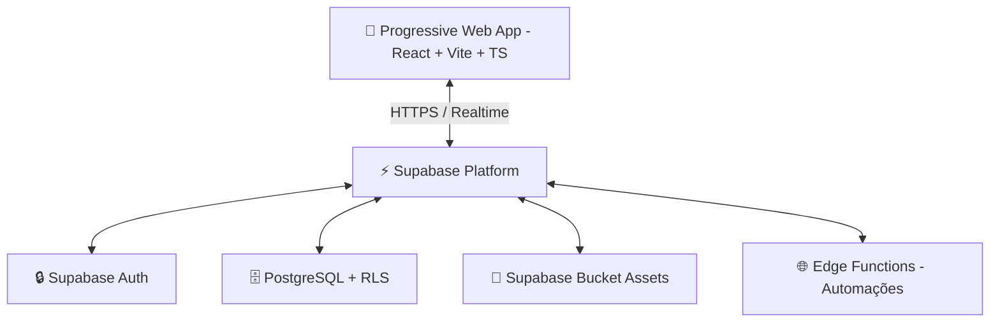

# 🚀 Documentação Técnica e Funcional: Esportiz


Esta é a documentação oficial, técnica e funcional do **Esportiz**, um ecossistema completo (ERP/SaaS) para gestão inteligente de escolas esportivas de alto rendimento e arenas esportivas multiuso (Beach Tennis, Futevôlei, Vôlei de Praia e centros esportivos).

---

## 🧭 1. Visão Geral e Propósito

O **Esportiz** foi concebido sob a premissa de que a gestão esportiva e de quadras deve ser altamente dinâmica, acessível e focada na experiência mobile (mobile-first). O aplicativo unifica o controle operacional, o CRM de alunos/reservantes, o fluxo financeiro de mensalidades e locações, o PDV (Ponto de Venda) com controle rigoroso de estoque, o Portal do Aluno e a Reserva Online de quadras em uma interface Progressive Web App (PWA) de alto padrão estético.

O sistema é altamente adaptativo, mudando sua interface e terminologia com base no perfil do negócio (Escola Esportiva ou Arena), garantindo uma experiência personalizada para cada tipo de cliente.

---

## 🛠️ 2. Arquitetura e Stack Tecnológica

O sistema utiliza as tecnologias mais robustas e modernas de mercado para garantir performance extrema, segurança de dados e capacidade offline:



### 💻 Frontend
- **Framework Core:** [React 18](https://reactjs.org/) executado sob a velocidade do [Vite](https://vitejs.dev/).
- **Tipagem Dinâmica:** [TypeScript](https://www.typescriptlang.org/) para solidez do código em produção.
- **Estilização e Design System:** [Tailwind CSS](https://tailwindcss.com/) com componentes semânticos e customizáveis do [Shadcn/UI](https://ui.shadcn.com/) (Radix UI).
- **Gerenciamento de Estado e Cache:** [TanStack Query v5 (React Query)] para controle inteligente de cache e sincronização de dados.
- **Ícones:** Lucide React.

### ☁️ Backend & Infraestrutura (BaaS)
- **Engine de Banco de Dados:** PostgreSQL hospedado e otimizado no [Supabase](https://supabase.com/).
- **Camada de Autenticação:** Supabase Auth (JWT, persistência de sessão).
- **Hospedagem e Roteamento:** Cloud de alta disponibilidade na [Vercel](https://vercel.com/).

---

## 🔒 3. Segurança Multi-tenant & Banco de Dados

Para garantir que arenas e escolas distintas utilizem o mesmo software sem qualquer risco de vazamento de dados, o Esportiz implementa uma arquitetura **Multi-tenant baseada em Row Level Security (RLS)** diretamente na camada do PostgreSQL. Toda tabela de dados cruciais (`students`, `payments`, `plans`, `comandas`, `sales`, `courts`, `training_sessions`) possui uma chave relacional com o proprietário (`user_id` ou `tenant_id`). As políticas de segurança garantem que um usuário só possa ler e escrever dados pertencentes ao seu próprio tenant.

---

## 🎭 4. Core Adaptativo: Os Modelos de Negócio

O sistema adapta dinamicamente seus textos, menus, painéis analíticos e funcionalidades com base no perfil comercial da empresa. Isso é gerenciado através do `useBusinessContext`, que fornece as labels corretas para cada termo.

### 4.1. Perfis de Negócio

| Recurso / Perfil | 🏫 Escola Esportiva (CT) | 🏟️ Arena (Locação de Quadras) |
| :--- | :--- | :--- |
| **Foco Operacional** | Frequência, Mensalidades e Desempenho. | Agenda de Locações, Bar, Controle de Estoque e Vendas. |
| **Termo Principal** | Aluno | Reservante / Cliente |
| **Atividade** | Treinos / Aulas | Reservas de Quadra |
| **Planos** | Mensalidades / Planos | Pacotes de Horas |
| **Portais Públicos** | Portal do Aluno (`/portal-aluno`) | Reserva Online (`/agendar`, compatível também com `/agendamento`) |

### 4.2. Labels Dinâmicas
O sistema mapeia termos como:
- `studentLabel` -> "Aluno" ou "Cliente"
- `groupLabel` -> "Turma" ou "Grupo"
- `trainingLabel` -> "Treino" ou "Aula"
- `ctLabel` -> "CT" ou "Arena"

---

## 🚀 5. Onboarding e Configuração Inicial

Para novos usuários, o Esportiz oferece um fluxo de **Onboarding** guiado (`/onboarding`) que facilita a configuração inicial do sistema:
1. **Identificação:** Definição do nome do negócio.
2. **Perfil de Negócio:** Escolha entre Escola Esportiva ou Arena (definindo o comportamento do Core Adaptativo).
3. **Objetivo Inicial:** Foco em Alunos, Agenda ou Financeiro.
4. **Personalização:** Upload da logo da marca (PNG, JPG ou WEBP até 2MB).

---

## 📦 6. Módulos Operacionais Detalhados

### 📊 6.1. Dashboard e Business Intelligence (Adaptativo)
O Dashboard principal se reconstrói dependendo do nicho de atuação:
- **Para CTs/Escolas:** Foco absoluto no faturamento de mensalidades, crescimento do número de alunos (Ativos/Inativos) e índices de inadimplência.
- **Para Arenas:** Visão gráfica focada na ocupação das quadras (horários vagos vs. locados) e ticket médio de vendas do bar/comandas.
- **Cards de Métricas:** Exibem dados como Total de Alunos, Faturamento Mensal, Taxa de Ocupação e Inadimplência.
- **Alertas:** Notificações de aniversariantes do dia e pendências financeiras.

---

### 🌐 6.2. Ecossistema "Self-Service": Portais e CRM
- **🎾 Portal de Reservas Online (`/agendar`, compatível também com `/agendamento`):** Motor público para locação de quadras. Clientes visualizam os blocos de horários livres da arena e realizam a reserva online, reduzindo o trabalho da secretaria.
- **📱 Portal do Aluno (`/portal-aluno`):** Web-app privado onde o aluno gerencia faturas em aberto, acompanha sua taxa de presença e visualiza seu histórico.
- **Ficha Integrada (CRM):** Perfil unificado do aluno/reservante no admin com foto, nível técnico, histórico de pagamentos, turmas vinculadas e atalhos rápidos para contato.

---

### 📅 6.3. Calendário, Turmas e Agenda de Arenas
- **Agenda de Arenas Avançada (`/agenda-arena`):** Gestão de "Courts" (Quadras físicas), organizando reservas avulsas ou de mensalistas em uma matriz de horários visual e interativa.
- **Gestão de Turmas Fixas (`/turmas`):** Controle de alunos por turma, com definição de dias da semana, horários e professor responsável.
- **Chamada Inteligente (`/chamada`):** Interface otimizada para dispositivos móveis para registro rápido de presença/falta na beira da quadra.

---

### 📋 6.4. Estoque, PDV e Comandas (Módulo Arena/Bar)
- **Controle Rigoroso de Estoque (`/produtos`):** Cadastro de produtos com preço de custo, preço de venda e quantidade em estoque. Alertas visuais para produtos com estoque baixo.
- **Gestão de Comandas (`/comandas`):** Motor completo de consumo para bar/restaurante. Comandas podem ser vinculadas a mesas, quadras ou CPFs. Permite adicionar produtos, aplicar descontos e realizar pagamentos parciais (racha da conta).
- **Ponto de Venda (PDV) (`/vendas`):** Interface para lançamento de compras diretas no balcão de forma rápida, sem a necessidade de abrir uma comanda.

---

### 💰 6.5. ERP Financeiro e Recebimentos
- **Painel Financeiro (`/financeiro`):** Controle centralizado de todas as movimentações financeiras.
- **Mensalidades e Cobranças:** Gestão de planos, geração de faturas e controle de recebimentos.
- **Pagamentos Parciais:** Suporte a recebimentos parciais, permitindo abater dívidas gradualmente.
- **Gestão de Despesas (`/despesas`):** Registro e categorização de custos operacionais (luz, manutenção, salários) para cálculo real do fluxo de caixa e lucro líquido.
- **Configuração de PIX:** Armazenamento de chaves PIX da instituição para facilitar o checkout e identificação de pagamentos.

---

### 📄 6.6. Contratos Digitais (Novo)
- **Geração Automatizada (`/contratos`):** O sistema permite gerar contratos de prestação de serviços preenchidos automaticamente com os dados do aluno, plano contratado, modalidade e valores.
- **Impressão Direta:** Layout otimizado para impressão (print-friendly) diretamente do navegador, com visualização prévia em tela.

---

### 🏷️ 6.7. Modalidades e Unidades
- **Gestão de Modalidades (`/modalidades`):** Cadastro e organização das atividades esportivas oferecidas (ex: Beach Tennis, Futevôlei).
- **Estatísticas por Modalidade:** Visão geral do número de alunos e treinos vinculados a cada modalidade, identificando as atividades de maior destaque.

---

### 🎨 6.8. Customização e Comunicação
- **White Label:** Logo, paleta de cores primária e nome do negócio da arena são refletidos não apenas no painel administrativo, mas em todos os portais públicos.
- **Comunicação em Massa (`/comunicacao`):** Motor de envio de mensagens (via e-mail ou integração com WhatsApp) para segmentos específicos de alunos (ex: alunos de uma turma específica ou inadimplentes).

---

## 📱 7. PWA & Recursos Offline

O Esportiz é certificado como **Progressive Web App (PWA)**, o que garante:
- Instalação "Add to Homescreen" nativa em iOS e Android.
- Carregamento instantâneo através de Service Workers e otimização de cache.
- Ícone dedicado na gaveta de aplicativos do usuário.

---

## 🛠️ 8. Guia de Instalação e Execução

### Pré-requisitos
- Node.js (v18 ou superior)
- NPM ou Yarn

### Passos de Execução Local
1. `git clone https://github.com/th91br/Esportiz.git`
2. `npm install`
3. Crie um arquivo `.env` na raiz do projeto com as seguintes variáveis:
   ```env
   VITE_SUPABASE_URL=sua_url_do_supabase
   VITE_SUPABASE_PUBLISHABLE_KEY=sua_chave_publicavel_do_supabase
   ```
4. `npm run dev` para iniciar em modo de desenvolvimento.
5. `npm run build` para empacotar para produção.

---
**Esportiz ERP 2.5.0** - Developed and documented with ❤️ by **Esportiz Team**.
